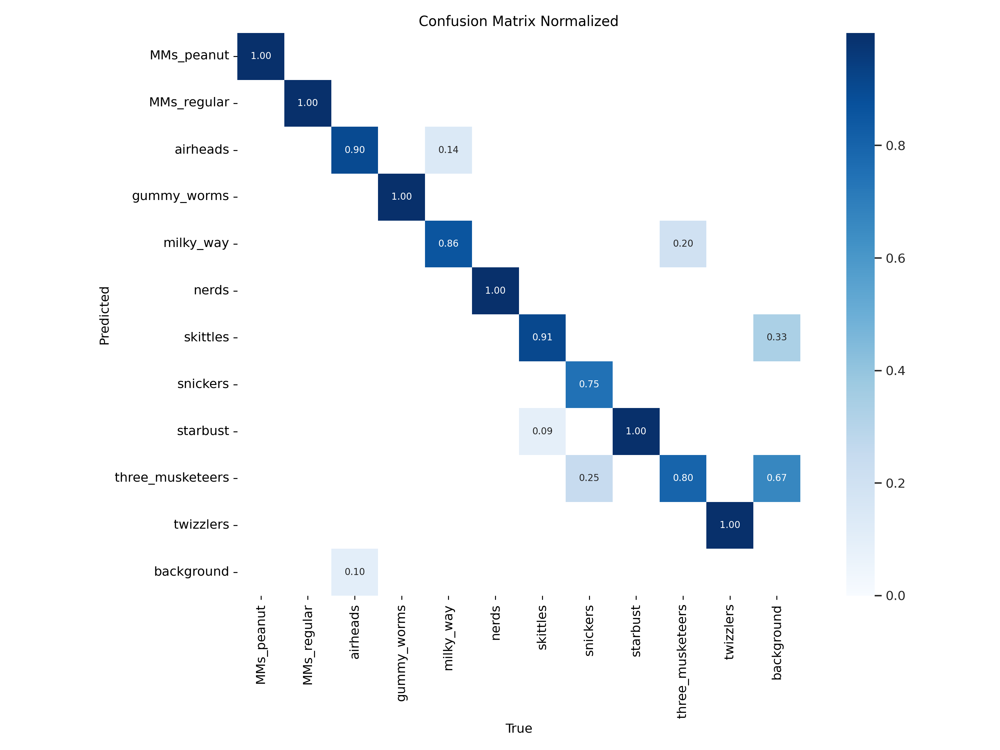

# ObjectDetectionModel

# 🍬 Sweet Success with Object Detection – Candy Detection using YOLO

Ever wondered if AI can recognize your favorite candy?  
This project explores real-time **object detection** using the **YOLO (You Only Look Once)** model trained on a custom dataset of various candies!

## 🔍 Project Overview

This deep learning project leverages YOLO to detect and classify different types of candies from images. It's a fun yet practical example of how AI can be applied to custom, niche datasets using transfer learning and annotation tools.

## 🎯 Objectives

- Build an end-to-end object detection pipeline
- Collect and annotate a custom dataset of candies
- Train YOLO with optimized settings for small object detection
- Evaluate detection accuracy and real-time performance

## 🛠️ Tools & Technologies

- Python
- YOLOv5 (Ultralytics)
- OpenCV
- PyTorch
- LabelImg (for annotation)
- Google Colab / Jupyter Notebook

## 🧠 Key Highlights

✅ Collected and annotated a dataset of various candies  
✅ Trained YOLOv5 model for real-time object detection  
✅ Achieved high accuracy distinguishing between candy types  
✅ Used **transfer learning** to speed up training and boost accuracy

## 🚀 Results/ demo
<video controls src="object_detection_video-1.mp4" title="Demo"></video>

🧠 Learnings

Working with a small custom dataset taught me a lot about data quality and augmentation.
YOLOv5's speed and performance make it ideal for real-time applications—even in sweet scenarios like this one!

🤔 Got Ideas?

Have a cool dataset or object detection idea in mind? Let’s collaborate or discuss it—feel free to open an issue or connect on LinkedIn!

